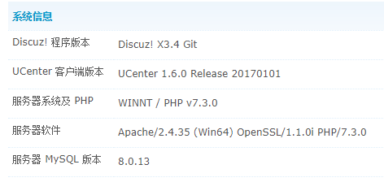

# [CẢNH BÁO THAY ĐỔI ĐỘT PHÁ]
## Người dùng thông thường không nên tải mã của chi nhánh này vào lúc này


### ** 3.5 Ghi chú phát hành **

So với phiên bản 3.4, các sửa đổi sau đã được thực hiện:

#### 1. Các thay đổi liên quan đến cơ sở dữ liệu

Phiên bản 3.5 hỗ trợ hai công cụ cơ sở dữ liệu, InnoDB và MyISAM. Dưới cả hai công cụ, cơ sở dữ liệu không còn hỗ trợ mã hóa utf8 mà thay vào đó hỗ trợ mã hóa utf8mb4.

#### 2. Các thay đổi liên quan đến IP

Trong phiên bản 3.5, các thay đổi sau đã được thực hiện để hỗ trợ IPv6

##### 2.1 Thư viện địa chỉ IP

Hệ thống hiện hỗ trợ nhiều thư viện địa chỉ, có thể được chọn thông qua các mục cấu hình sau trong tệp cấu hình:

```
$_config['ipdb']['setting']['fullstack'] = '';	// 系统使用的全栈IP库，优先级最高
$_config['ipdb']['setting']['default'] = '';	// 系统使用的默认IP库，优先级最低
$_config['ipdb']['setting']['ipv4'] = 'tiny';	// 系统使用的默认IPv4库，留空为使用默认库
$_config['ipdb']['setting']['ipv6'] = 'v6wry'; // 系统使用的默认IPv6库，留空为使用默认库
```

地址库对应的class为 `ip_<地址库名称>` ，位于 `source/class/ip` 下面。系统会根据配置自动加载相应的class，相应的class也可以有自己的配置项，其规则为：

```
 * $_config['ipdb']下除setting外均可用作自定义扩展IP库设置选项，也欢迎大家PR自己的扩展IP库。
 * 扩展IP库的设置，请使用格式：
 * 		$_config['ipdb']['扩展ip库名称']['设置项名称'] = '值';
 * 比如：
 * 		$_config['ipdb']['redis_ip']['server'] = '172.16.1.8';
```

Hệ thống hiện có thư viện IPv4 tích hợp và thư viện IPv6

##### 2.2 Chặn IP

现在IP地址封禁，不再使用 `*` 作为通配符，而是使用[子网掩码(CIDR)](https://cloud.tencent.com/developer/article/1392116)的方式来指定要封禁的地址范围。

IP封禁的配置，现在保存在pre_common_banned表中，**每次**用户访问的时候，都会触发检查。现在的检查效率较高，每次只会产生一个带索引的SQL查询（基于VARBINARY类型的大小比较）。对于一般的站点性能不会带来问题。另外可以启用Redis缓存，来进一步提高性能。另外还有一个配置项可关闭此功能，使用外部的防火墙等来进行IP封禁管理：

```
$_config['security']['useipban'] = 1; // 是否开启允许/禁止IP功能，高负载站点可以将此功能疏解至HTTP Server/CDN/SLB/WAF上，降低服务器压力
```

##### 2.3 Thu thập địa chỉ IP

IP地址获取，现在默认只信任REMOTE_ADDR，其它的因为太容易仿造，默认禁止。获取的方式也可以扩展，在配置文件中增加了以下配置项

```
/**
 * IP获取扩展
 * 考虑到不同的CDN服务供应商提供的判断CDN源IP的策略不同，您可以定义自己服务供应商的IP获取扩展。
 * 为空为使用默认体系，非空情况下会自动调用source/class/ip/getter_值.php内的get方法获取IP地址。
 * 系统提供dnslist(IP反解析域名白名单)、serverlist(IP地址白名单，支持CIDR)、header扩展，具体请参考扩展文件。
 * 性能提示：自带的两款工具由于依赖RDNS、CIDR判定等操作，对系统效率有较大影响，建议大流量站点使用HTTP Server
 * 或CDN/SLB/WAF上的IP黑白名单等逻辑实现CDN IP地址白名单，随后使用header扩展指定服务商提供的IP头的方式实现。
 * 安全提示：由于UCenter、UC_Client独立性及扩展性原因，您需要单独修改相关文件的相关业务逻辑，从而实现此类功能。
 * $_config['ipgetter']下除setting外均可用作自定义IP获取模型设置选项，也欢迎大家PR自己的扩展IP获取模型。
 * 扩展IP获取模型的设置，请使用格式：
 * 		$_config['ipgetter']['IP获取扩展名称']['设置项名称'] = '值';
 * 比如：
 * 		$_config['ipgetter']['onlinechk']['server'] = '100.64.10.24';
 */
$_config['ipgetter']['setting'] = '';
$_config['ipgetter']['header']['header'] = 'HTTP_X_FORWARDED_FOR';
$_config['ipgetter']['iplist']['header'] = 'HTTP_X_FORWARDED_FOR';
$_config['ipgetter']['iplist']['list']['0'] = '127.0.0.1';
$_config['ipgetter']['dnslist']['header'] = 'HTTP_X_FORWARDED_FOR';
$_config['ipgetter']['dnslist']['list']['0'] = 'comsenz.com';
```

#### 3. Bộ nhớ đệm

3.5 tăng cường đáng kể sự hỗ trợ cho bộ đệm Redis Trong trường hợp sử dụng Redis, việc sử dụng bảng bộ nhớ hoàn toàn bị loại bỏ. bao gồm:

* 所有的原session内存表相关的功能，全部由Redis实现
* setting不再一次性加载，而是分批按需加载
* Lưu vào bộ nhớ cache kết quả phát hiện của chặn IP

Bạn nên định cấu hình tất cả các trạm khi bật bộ nhớ đệm Redis.

Do các giới hạn chức năng của memcached, các cải tiến trên không có giá trị đối với memcached.

**提示：由于 PHP 认为实现了 ArrayAccess 接口的对象并非完全等同于数组，因此原有依赖 array_key_exists 的插件或二次开发站点应取消对其的依赖。**

#### 4. Hỗ trợ tất cả các công tắc chức năng bao gồm cả diễn đàn

3.5现在支持几乎所有功能的开关，管理员甚至可以关闭论坛，只使用门户。相关的修改请点击 [PR291](https://gitee.com/Discuz/DiscuzX/pulls/291)


#### 5. Các thay đổi khác

* 增加了一个测试框架，可在后台运行，代码位于 `upload/tests` 下，测试用例可在 `upload/tests/class` 下添加。欢迎大家通过Pull Request提交测试用例
* 修改了安装程序最后一步的日志输出方式，现在整个创建数据库的过程日志都可实时显示
* 不再使用mysql驱动，只使用mysqli
* 内置了function_debug.php文件，通过 `$_config['debug'] = 1` 打开

#### 6. Yêu cầu môi trường hoạt động tối thiểu

**安全提示：我们强烈建议您使用仍在开发团队支持期内的操作系统、Web服务器、PHP、数据库、内存缓存等软件，超出支持期的软件可能会对您的站点带来未知的安全隐患。**
**性能提示：当 MySQL < 5.7 或 MariaDB < 10.2 时， InnoDB 性能下降较为严重，因此在生产系统上运行的站点应升级版本至 MySQL >= 5.7 或 MariaDB >= 10.2 以避免此问题。**

| Tên 	  | Tối thiểu    | Đề xuất     | Khác                                                             |
| ------- | ------------ | ----------- | ------------------------------------------------------------------ |
| PHP     | >= 5.6.0     | 7.3 - 8.1   | 依赖 XML 扩展、 JSON 扩展、 GD 扩展 >= 1.0 ，PHP 8.0 - 8.1 为测试性支持 |
| MySQL   | >= 5.5.3     | 5.7 - 8.0   | 如使用 MariaDB ，推荐版本为 >= 10.2                                   |

### Ảnh chụp màn hình
